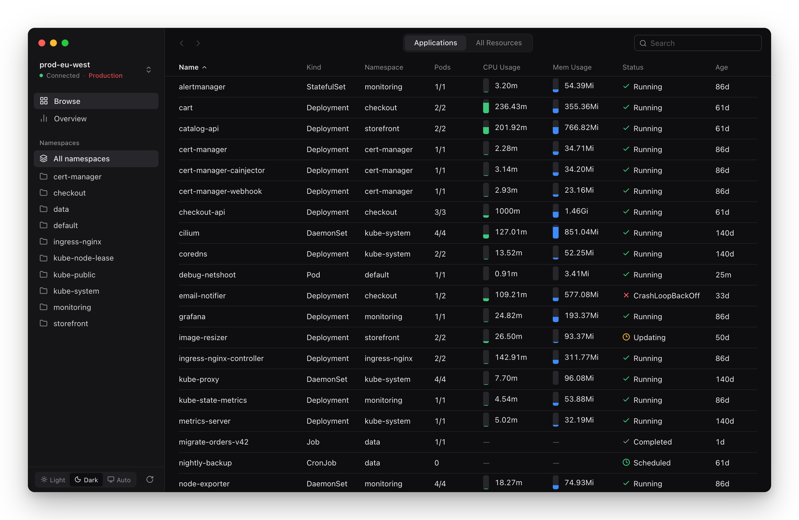
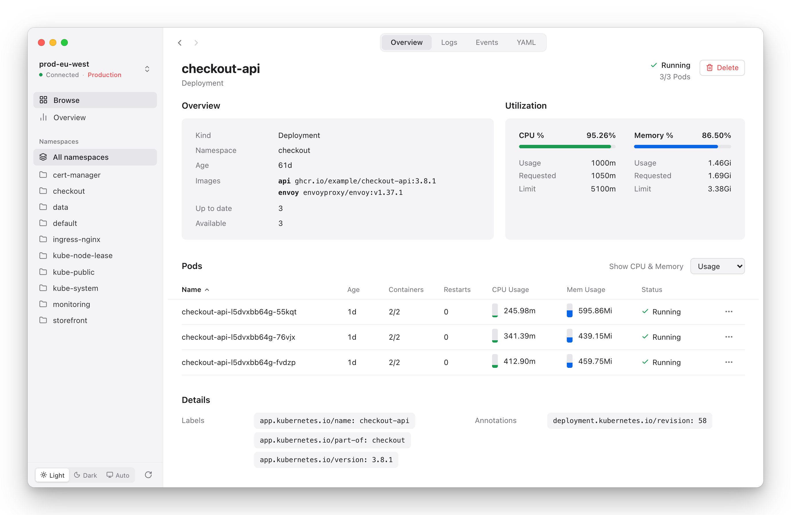
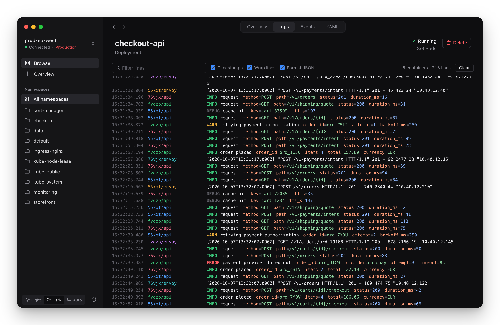
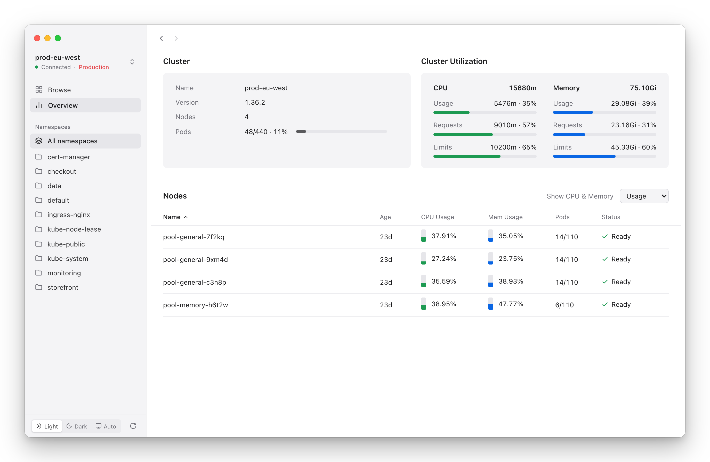
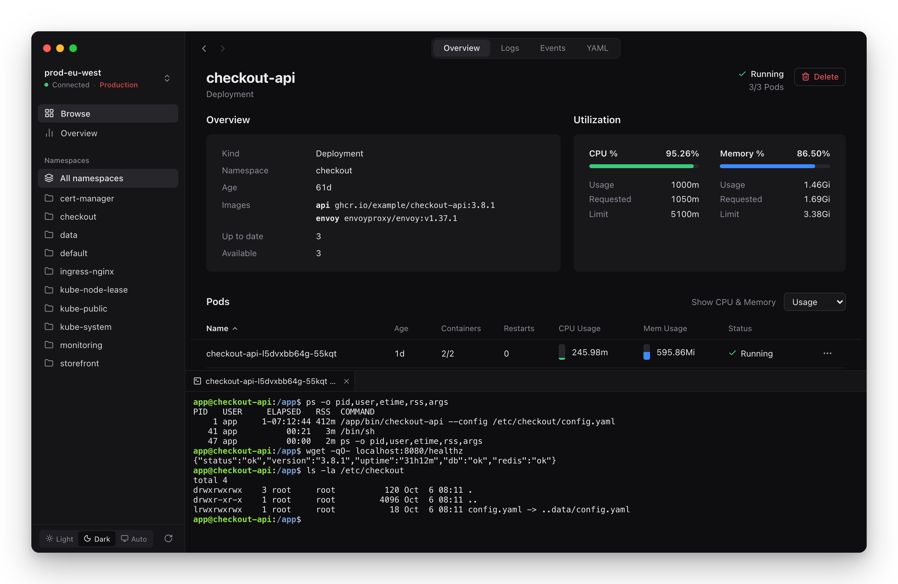

# Porthole

A fast desktop client for Kubernetes. Browse every cluster in your kubeconfig, follow logs,
open shells, see what each node and workload is using, and edit or delete resources. It never
creates resources.

Implemented entirely in Rust with [egui](https://github.com/emilk/egui). Kubernetes watches,
logs and container terminals run in the same native process.



## Features

- **Applications.** Deployments, StatefulSets, DaemonSets, CronJobs, Jobs and standalone pods in
  one live table, with pod counts, CPU and memory usage, and the status that matters (a crash-looping
  pod surfaces on its Deployment).
- **All resources.** Every type the cluster serves, custom resources included, grouped the way
  you think about them, with kind-specific columns. Choose **All types** for one combined table
  of every type in the selected namespace.
- **Resource pages.** Overview, utilization against requests and limits, pods or containers with
  live usage, labels and annotations, and the Services, Ingresses, Config Maps and claims that
  belong to the workload. Tabs for logs, events and YAML.
- **Overview.** Cluster version, nodes and pods, cluster and per-node CPU, memory and pod capacity;
  switch nodes and pods between usage, requests and limits. Usage needs
  [metrics-server](https://github.com/kubernetes-sigs/metrics-server); without it the app says why
  usage is missing.
- **Logs.** Follows every container of every pod of a workload at once and picks up new pods
  during a rollout. JSON lines are shown as level, message and coloured fields; plain lines get
  their level word coloured. Filter, timestamps, wrapping.
- **Shells.** Interactive terminals into containers, docked under the current view so they keep
  running while you browse.
- **Edit and delete, never create.** The YAML tab saves over the object it opened, like
  `kubectl edit`: the save must keep its kind, name, namespace and `resourceVersion`, so it can
  neither create an object nor overwrite a change made since you loaded it. Delete anything from its
  right-click menu; namespaces, and anything on a cluster labelled to ask, need the name typed back.
- **Live, and instant.** Watches, not polling. Each context keeps one cluster-wide watch per
  resource type, started when you pick the context and shared by every view, so switching views or
  namespaces never waits. The last lists and resource types are saved locally, so the app opens on
  them while the live data catches up.
- **Cluster labels.** Give any cluster a tag and colour (Production, Staging, a team name) from the
  cluster menu, and optionally require typing the name before every delete on it. Nothing is
  guessed from context names.
- **Keyboard.** A command palette (⌘K) jumps to any view, resource type, namespace, cluster, shell
  or object by name. Tables move with the arrow keys or J and K, open with Return, and take L for
  logs, S for a shell, Y for YAML, C to copy the name and M for the row's menu. ⌘1–3 switch views,
  Ctrl+Tab switches tabs, Ctrl+` moves between the shells and the view, and ? lists every shortcut
  (Ctrl in place of ⌘ on Windows and Linux).
- **Comfort.** Light, dark and auto themes; drag column headers to reorder them (remembered per
  table); resizable sidebar; back and forward navigation; namespace filter; search for resource
  types by kind, short name or API group.

## Screenshots

A Deployment's page: overview, utilization against requests and limits, and its pods with live
usage.



The same Deployment's logs, followed across all of its pods, with JSON lines shown as level,
message and fields.



The cluster overview: capacity, requests, limits and usage, per cluster and per node.



A shell into a container, docked under the current view.



## Install

Download the latest build from [Releases](https://github.com/dmatviichuk/Porthole/releases):

| Platform | File |
| --- | --- |
| macOS, Apple silicon | `Porthole_<version>_aarch64.dmg` |
| macOS, Intel | `Porthole_<version>_x64.dmg` |
| Windows | `Porthole_<version>_x64_en-US.msi` or `Porthole_<version>_x64-setup.exe` |
| Linux | `.AppImage`, `.deb` or `.rpm` |

Builds are not code-signed yet. On macOS, after copying the app to Applications, clear the
download quarantine once:

```sh
xattr -dr com.apple.quarantine /Applications/Porthole.app
```

On Windows, SmartScreen asks for confirmation the first time.

Porthole reads the same kubeconfig as kubectl (`$KUBECONFIG` or `~/.kube/config`). Exec credential
plugins such as `aws eks get-token` or `kubelogin` work as they do in your terminal: when the app
starts from Finder or the Dock, it borrows `PATH` and `KUBECONFIG` from your login shell.

## Documentation

Building from source, working on the code and cutting a release are covered in [docs](docs/):
[Building from source](docs/building.md), [Development](docs/development.md) and
[Releasing](docs/releasing.md).

## License

Copyright 2026 Dmytro Matviichuk. Licensed under the [Apache License, Version 2.0](LICENSE).
